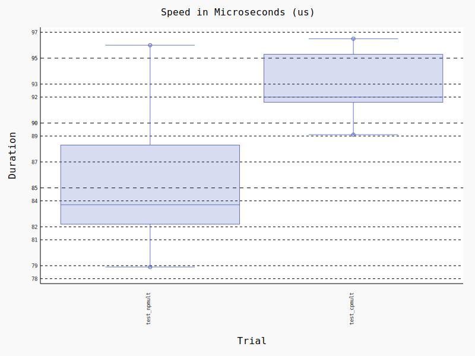
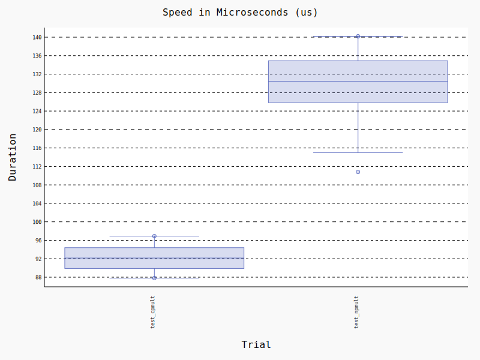
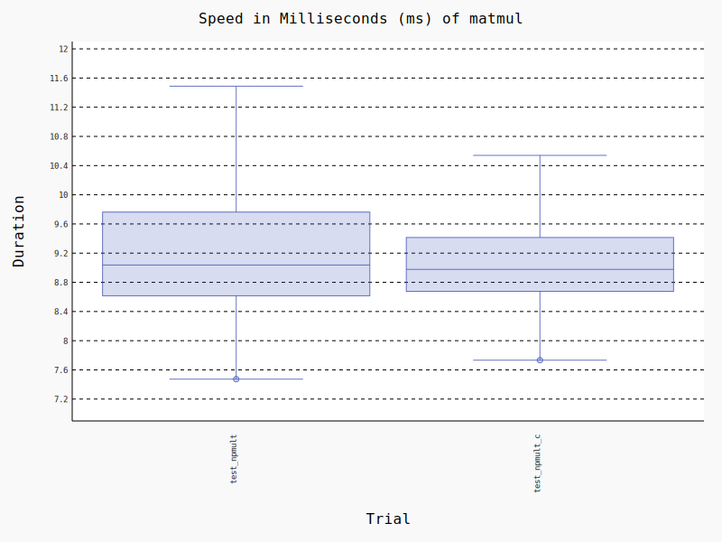
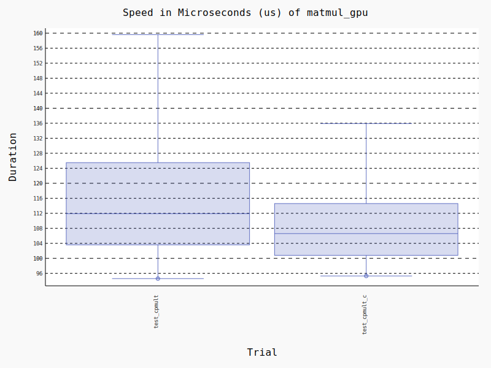

# Experimental Results

### Matrix Multiplication
Hey, we've gotta start somewhere. I'm sure that this has been done before, but it makes a good test run to make sure I've learned how to use the benchmarking & optimization tools correctly.

Using the script `time_trials/test_matfuncs.py` I found that for matrices of size ~175x175 and larger, cupy matmult is always faster. Below that size, numpy starts to win out. Naturally, there is some overhead in communicating the data in the matrices back and forth to the GPU which accounts for the bulk of the cupy execution time represented in these plots. Notably, cupy has a pretty significant initialization time, so all benchmarks will need to use the `warmup_rounds` flag to be truly accurate.

Of course, I need to know if these metrics change when we compile the code with Cython (and no other changes!).

I wonder how this number changes with other data types (int/int8, binary, ternary) and operations. For now however, I will leave those as later avenues of exploration.
#### Conclusions & Notes:
 - It seems like the cythonized versions of each operation *tend* to be faster, but this isn't always the case. In general, however, the larger the matrix the more likely it is to favor the cythonized version.
 - Matrices under about 150x150 cells should be multiplied using the CPU due to the overhead of communicating with the GPU.

#### TODO:
1. Implement 8-bit and 4-bit quantization https://github.com/TimDettmers/bitsandbytes/tree/main
2. Explore [boolean matrices](https://stackoverflow.com/questions/18447321/binary-matrix-multiplication-bit-twiddling-hack) and [ternary matrices](https://github.com/google/gemmlowp)

#### Open Questions:
1. When executing a NN forward pass, is it more efficient to stick with just the GPU or to mix GPU operations with CPU operations?
2. How does the runtime of dtype fp16 compare to fp32?